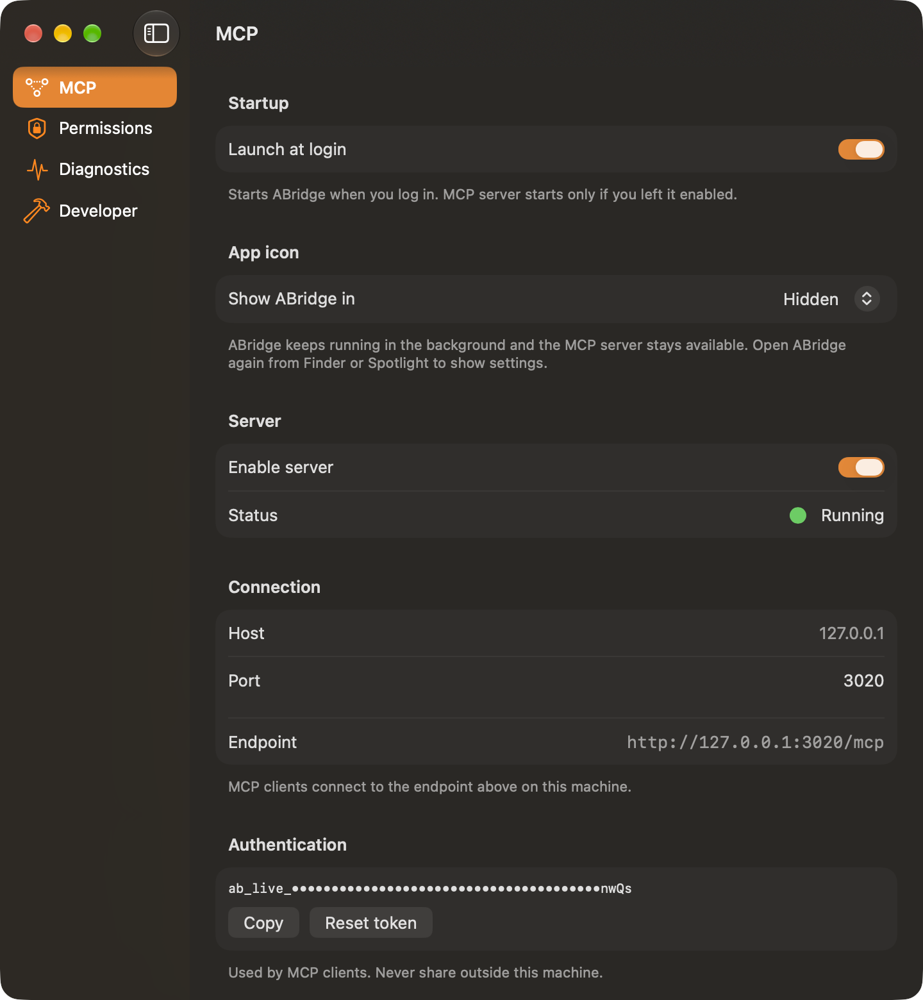
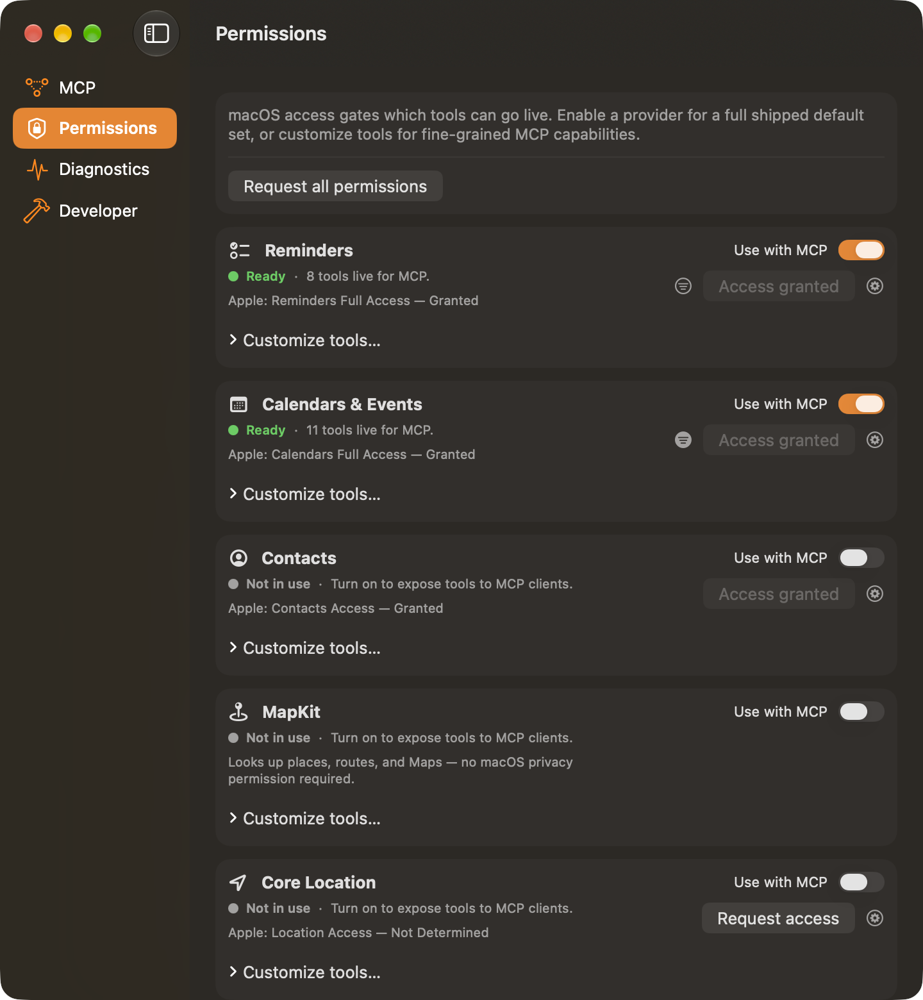
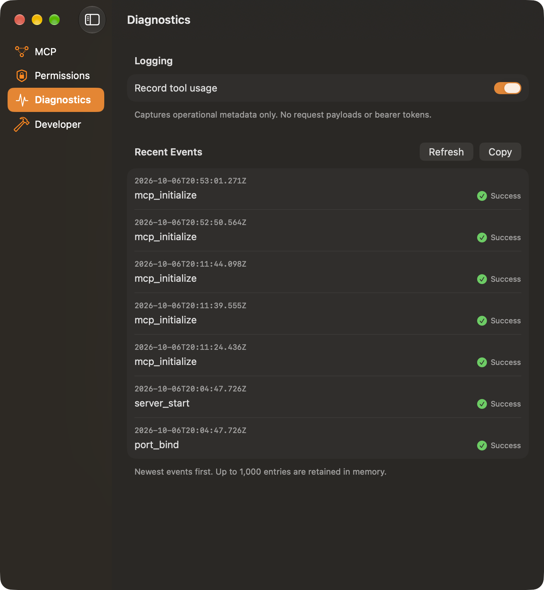

<br/>
<p align="center">
  <picture>
    <source media="(prefers-color-scheme: dark)" srcset="icon/mark-dark.png">
    </img>
  </picture>
</p>

# ABridge

**Apple frameworks on your Mac, one local MCP endpoint.**

A native macOS menu bar app with a Rust MCP/HTTP core. Swift owns the UI, system permission prompts, and thin Apple adapters. Rust owns the server, auth, routing, and tool registry (UniFFI). Clients talk to `127.0.0.1` only.

Providers: EventKit (Reminders, Calendars, Events), Contacts, MapKit, Core Location, and Vision. MCP payloads are mechanical JSON of Apple objects: no reshaped domain models, no hidden fields.

Access is two layers: macOS privacy permission, then per-capability MCP toggles in Settings. Only enabled capabilities appear in `tools/list`. Reminders lists and event calendars default to sharing all of them; Permissions can restrict MCP to a subset.

<p align="center">
  
  
  
</p>

### Connect your MCP client

| | |
|---|---|
| **Endpoint** | `http://127.0.0.1:3020/mcp` (default; configurable in the app) |
| **Auth** | Bearer token (copy from the menu bar app) |
| **Prerequisite** | ABridge must be running before your client connects |

Binds to loopback. Apple frameworks remain the system of record.

## Install

Requires macOS 26+ on Apple silicon.

```sh
brew install --cask rcanoff/tap/abridge
```

Or download `ABridge-<version>.dmg` from [Releases](https://github.com/rcanoff/abridge/releases) and drag ABridge to Applications. Builds are Developer ID signed and notarized.

ABridge updates itself through Sparkle: **Check for Updates…** in the menu bar, plus scheduled checks once you allow them.

## Build from source

```sh
git clone git@github.com:rcanoff/abridge.git
cd abridge
xcodegen generate
just build-rust
open ABridge.xcodeproj
```

Build and run the app, start the server from the menu bar, then point your MCP client at the endpoint above.

Builds are ad-hoc signed by default, so every rebuild has a new signature and macOS asks again for Keychain access to the API key and for privacy permissions. To sign local builds with your development certificate instead, create `Configs/Local.xcconfig` (gitignored) with your team:

```
DEVELOPMENT_TEAM = <your team ID>
CODE_SIGN_STYLE = Manual
CODE_SIGN_IDENTITY = Apple Development
```

Choose **Always Allow** at the next Keychain prompt; later rebuilds keep that grant.

## Prerequisites

macOS 26+, Xcode 26+, Rust 1.85+, [just](https://github.com/casey/just), [xcodegen](https://github.com/yonaskolb/XcodeGen), SwiftFormat, SwiftLint (`brew install swiftformat swiftlint`).

Icon tracing (`just gen-icon-svg`) also needs ImageMagick and potrace.

## MCP tools

Tool names are `<provider>_<domain>_<operation>`, or `<provider>_<operation>` when the provider has no domain, using only lowercase letters, digits, and underscores. Discover the live set with `tools/list`; call with `tools/call`.

### EventKit: Reminders

- `eventkit_reminders_list_lists`
- `eventkit_reminders_create_list`
- `eventkit_reminders_delete_list`
- `eventkit_reminders_list_reminders`
- `eventkit_reminders_search_reminders`
- `eventkit_reminders_get_reminder`
- `eventkit_reminders_create_reminder`
- `eventkit_reminders_update_reminder`
- `eventkit_reminders_delete_reminder`
- `eventkit_reminders_move_reminder`
- `eventkit_reminders_complete_reminder`
- `eventkit_reminders_uncomplete_reminder`
- `eventkit_reminders_set_reminder_alarms`
- `eventkit_reminders_set_reminder_recurrence`

### EventKit: Calendars and Events

- `eventkit_calendars_list_calendars`
- `eventkit_calendars_create_calendar`
- `eventkit_calendars_update_calendar`
- `eventkit_calendars_delete_calendar`
- `eventkit_events_list_events`
- `eventkit_events_search_events`
- `eventkit_events_get_event`
- `eventkit_events_create_event`
- `eventkit_events_update_event`
- `eventkit_events_delete_event`
- `eventkit_events_move_event`
- `eventkit_events_set_event_alarms`
- `eventkit_events_set_event_recurrence`

Invitation RSVP (`accept_invitation`, `decline_invitation`, `tentative_invitation`) is not supported.

### Contacts

- `contacts_list_contacts`
- `contacts_search_contacts`
- `contacts_get_contact`
- `contacts_create_contact`
- `contacts_update_contact`
- `contacts_delete_contact`
- `contacts_link_contacts`
- `contacts_unlink_contacts`
- `contacts_list_groups`
- `contacts_create_group`
- `contacts_update_group`
- `contacts_delete_group`

### MapKit

- `mapkit_search_places`
- `mapkit_search_nearby`
- `mapkit_reverse_geocode`
- `mapkit_forward_geocode`
- `mapkit_calculate_route`
- `mapkit_estimate_travel_time`
- `mapkit_open_navigation`
- `mapkit_get_place`

### Core Location

- `corelocation_get_current_location`

### Vision

- `vision_recognize_text`
- `vision_recognize_documents`
- `vision_detect_barcodes`
- `vision_detect_face_landmarks`

### Diagnostics

- `diagnostics_get_usage_log`

### Not supported

LocalAuthentication, AVFoundation, CoreBluetooth, HealthKit, PhotoKit, UserNotifications, HomeKit, MusicKit, Shortcuts.

## Architecture

- **Swift:** UI, permissions, Keychain, thin Apple adapters
- **Rust:** MCP/HTTP server, auth, routing, provider registry, tests

See the [architecture guide](docs/architecture-bootstrap-guide.md) for bootstrap steps and endpoint design.

Settings tabs: MCP, Permissions, Diagnostics, Developer.

## Project map

| Path | Purpose |
|------|---------|
| `ABridge/` | SwiftUI app, stores, services, thin providers, app icon, menu-bar mark |
| `ABridgeTests/` | Swift Testing unit tests |
| `rust/abridge_core/` | MCP/HTTP server, auth, routing, Rust tests |
| `ABridgeCore/` | Generated by `just build-rust`. Not committed. Do not edit. |
| `icon/` | Mark source: preview, SVG, Icon Composer, README tiles |
| `project.yml` | XcodeGen source. Run `xcodegen generate` after edits |
| `justfile` | Task runner for dev and CI |
| `.githooks/` | Git hooks (verify and optional review chain) |
| `local/review/` | Local agent PR review (gitignored) |
| `docs/` | PRD, conventions, architecture guide |

## Development commands

| Command | Purpose |
|---------|---------|
| `just test-swift` | Swift unit tests |
| `just test-rust` | Rust tests |
| `just lint-rust` | Rust fmt + clippy |
| `just fmt-check-swift` | SwiftFormat lint |
| `just lint-swift` | SwiftLint |
| `just ci` | Full local CI parity (macOS) |
| `just ci-rust` | Rust CI subset |
| `just ci-macos` | macOS CI subset |
| `just review` | Local agent code review |
| `just gen-icon-svg` | Trace `icon/previews/mark.jpg` to SVG |
| `just gen-menubar-icons` | Rasterize the SVG into the menu-bar template |
| `just release-build <version>` | Signed, notarized DMG and Sparkle appcast in `build/release/` |

## CI

CI workflows are `workflow_dispatch` only. Run CI locally before pushing:

```sh
just preflight   # alias for `just ci`: Rust + macOS steps
```

| Command | What it runs |
|---------|----------------|
| `just ci` | Full local CI parity (`ci-rust` + `ci-macos-steps` on macOS) |
| `just ci-rust` | Rust fmt, clippy, tests (Linux or macOS) |
| `just ci-macos` | SwiftFormat, SwiftLint, UniFFI build, Swift tests (macOS only) |

Workflow definitions stay in `.github/workflows/`.

Not automated in CI: EventKit permission dialogs, interactive Keychain, E2E MCP sessions. See `docs/conventions.md`.

## Releasing

Push a `vX.Y.Z` tag from `main`. The [Release workflow](.github/workflows/release.yml) builds the Rust core, archives a Developer ID signed build with the hardened runtime, notarizes and staples the app and DMG, generates the Sparkle `appcast.xml`, publishes both to a GitHub release, and updates the cask in [rcanoff/homebrew-tap](https://github.com/rcanoff/homebrew-tap). The job runs in the `release` environment (Settings → Environments): its secrets, listed in the workflow header, reach only `v*` tag runs approved by a required reviewer.

```sh
git tag v1.0.0 && git push origin v1.0.0
```

- `CFBundleShortVersionString` comes from the tag; `CFBundleVersion` is the commit count of the tagged commit, so Sparkle sees every release as newer. MCP clients see the same version as `serverInfo.version`.
- Xcode and other local builds take the version from `git describe --tags` (for example `0.3.0-4-gabc1234-dirty`) via `scripts/stamp-build-version.sh`; with no reachable tag they keep the `0.0.0` placeholder from `project.yml`.
- The app reads its feed from `releases/latest/download/appcast.xml`, so the repository must be public for updates and Homebrew downloads to work.
- The Sparkle EdDSA private key signs every update; keep a backup outside CI. Losing it strands installed copies on their current version.
- Local build: `just release-build 1.0.0` (environment variables are documented at the top of `scripts/release.sh`); add `--skip-notarization` to check signing and packaging without submitting to Apple.

## Contributing

- Branch naming: `feat/...`, `chore/...` (see `AGENTS.md`)
- Before opening a PR: `just preflight`
- Install hooks: `git config core.hooksPath .githooks`
- Agent rules: `AGENTS.md`
- Deep reference: `docs/conventions.md`, `docs/architecture-bootstrap-guide.md`, `docs/prd.md`

## License

This repository is licensed under the [Apache License 2.0](LICENSE.md).

## Security

Report vulnerabilities privately. See [SECURITY.md](SECURITY.md).
